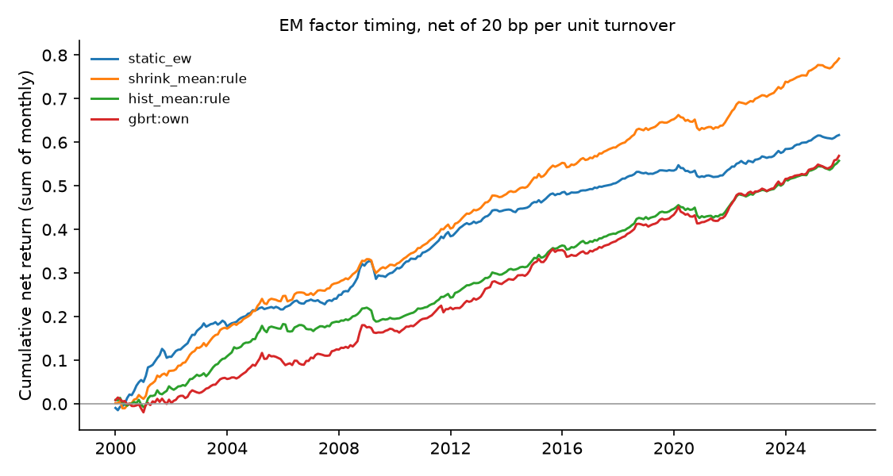

# Emerging-market factor timing — run summary

> **Real data (JKP global factor returns).** Results are out-of-sample forecasts; see caveats.

Test region: EM · out-of-sample from 2000 · cost 20.0 bp per unit of timing turnover

## Out-of-sample R² against each factor's historical mean

Positive = beats the historical mean. `cw_t` is the Clark–West statistic (monthly, Newey–West).

| model | scope | r2_vs_hist_pct | cw_t_hist | r2_vs_shrink_pct | cw_t_shrink | obs | months |
| --- | --- | --- | --- | --- | --- | --- | --- |
| shrink_mean | rule | 1.203 | 9.049 | 0.000 | nan | 801536 | 312 |
| enet | own | 1.157 | 8.733 | -0.046 | 1.559 | 801536 | 312 |
| ols | own | 1.148 | 8.722 | -0.055 | 1.611 | 801536 | 312 |
| enet | pooled | 1.119 | 8.831 | -0.084 | 2.029 | 801536 | 312 |
| ols | pooled | 1.108 | 8.825 | -0.096 | 2.101 | 801536 | 312 |
| gbrt | pooled | 1.096 | 8.952 | -0.108 | 4.248 | 801536 | 312 |
| enet | dm_only | 1.031 | 8.695 | -0.174 | 2.079 | 801536 | 312 |
| ols | dm_only | 1.011 | 8.698 | -0.194 | 2.096 | 801536 | 312 |
| gbrt | own | 0.993 | 8.885 | -0.212 | 3.662 | 801536 | 312 |
| gbrt | dm_only | 0.973 | 8.446 | -0.233 | 3.792 | 801536 | 312 |
| nn | pooled | 0.910 | 8.652 | -0.296 | 3.080 | 801536 | 312 |
| nn | own | 0.832 | 8.455 | -0.376 | 1.819 | 801536 | 312 |
| nn | dm_only | 0.728 | 8.335 | -0.481 | 3.885 | 801536 | 312 |
| hist_mean | rule | 0.000 | nan | -1.217 | -8.031 | 801536 | 312 |
| fmom | rule | -6.169 | 5.006 | -7.461 | 2.409 | 801536 | 312 |

## Timing portfolios (equal-weighted across countries)

| strategy | mean_ann_pct | vol_ann_pct | sharpe_gross | sharpe_net | turnover_monthly | months |
| --- | --- | --- | --- | --- | --- | --- |
| shrink_mean:rule | 3.192 | 1.598 | 1.998 | 1.905 | 0.061 | 312 |
| static_ew | 2.415 | 1.604 | 1.505 | 1.477 | 0.018 | 312 |
| hist_mean:rule | 2.319 | 1.514 | 1.532 | 1.413 | 0.073 | 312 |
| gbrt:own | 3.338 | 1.717 | 1.944 | 1.265 | 0.479 | 312 |
| gbrt:pooled | 3.689 | 2.014 | 1.831 | 1.168 | 0.552 | 312 |
| gbrt:dm_only | 3.833 | 2.101 | 1.824 | 1.125 | 0.611 | 312 |
| enet:own | 3.095 | 1.883 | 1.643 | 1.112 | 0.412 | 312 |
| nn:own | 3.063 | 1.857 | 1.650 | 1.069 | 0.446 | 312 |
| ols:own | 3.077 | 1.906 | 1.614 | 1.067 | 0.430 | 312 |
| nn:dm_only | 3.432 | 2.022 | 1.697 | 0.985 | 0.598 | 312 |
| nn:pooled | 3.233 | 2.093 | 1.544 | 0.896 | 0.558 | 312 |
| enet:pooled | 3.160 | 2.086 | 1.514 | 0.885 | 0.544 | 312 |
| ols:pooled | 3.144 | 2.100 | 1.497 | 0.857 | 0.557 | 312 |
| fmom:rule | 2.025 | 1.837 | 1.102 | 0.775 | 0.250 | 312 |
| enet:dm_only | 3.104 | 2.179 | 1.424 | 0.737 | 0.622 | 312 |
| ols:dm_only | 3.074 | 2.188 | 1.405 | 0.711 | 0.630 | 312 |

## Coverage

71 countries, 153 factors at most per country.
