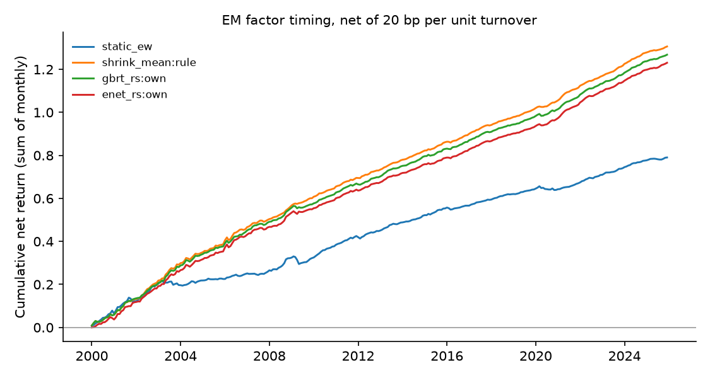

# Emerging-market factor timing — run summary

> **Real data (JKP global factor returns).** Results are out-of-sample forecasts; see caveats.

Test region: EM · out-of-sample from 2000 · cost 20.0 bp per unit of timing turnover

## Out-of-sample R² against each factor's historical mean

Positive = beats the historical mean. `cw_t` is the Clark–West statistic (monthly, Newey–West).

| model | scope | r2_vs_hist_pct | cw_t_hist | r2_vs_shrink_pct | cw_t_shrink | obs | months |
| --- | --- | --- | --- | --- | --- | --- | --- |
| enet | pooled | 1.540 | 9.165 | 0.172 | 4.355 | 801536 | 312 |
| gbrt_rs | pooled | 1.529 | 8.098 | 0.161 | 4.431 | 801536 | 312 |
| enet_rs | pooled | 1.524 | 8.781 | 0.156 | 3.671 | 801536 | 312 |
| ols | pooled | 1.523 | 9.163 | 0.155 | 4.349 | 801536 | 312 |
| ols_rs | pooled | 1.508 | 8.744 | 0.140 | 3.595 | 801536 | 312 |
| enet_rs | own | 1.496 | 8.757 | 0.128 | 3.778 | 801536 | 312 |
| gbrt_rs | own | 1.494 | 9.250 | 0.125 | 4.314 | 801536 | 312 |
| ols_rs | own | 1.489 | 8.762 | 0.120 | 3.675 | 801536 | 312 |
| enet | own | 1.482 | 8.685 | 0.114 | 3.789 | 801536 | 312 |
| gbrt | pooled | 1.478 | 8.332 | 0.110 | 4.986 | 801536 | 312 |
| enet | dm_only | 1.472 | 9.094 | 0.103 | 4.141 | 801536 | 312 |
| ols | own | 1.469 | 8.678 | 0.100 | 3.761 | 801536 | 312 |
| enet_rs | dm_only | 1.465 | 8.622 | 0.096 | 3.221 | 801536 | 312 |
| ols_rs | dm_only | 1.445 | 8.596 | 0.076 | 3.159 | 801536 | 312 |
| ols | dm_only | 1.445 | 9.095 | 0.076 | 4.123 | 801536 | 312 |
| gbrt_rs | dm_only | 1.445 | 7.856 | 0.076 | 3.921 | 801536 | 312 |
| shrink_mean | rule | 1.370 | 8.606 | 0.000 | nan | 801536 | 312 |
| gbrt | own | 1.350 | 8.701 | -0.020 | 4.336 | 801536 | 312 |
| gbrt | dm_only | 1.330 | 8.174 | -0.041 | 4.744 | 801536 | 312 |
| hist_mean | rule | 0.000 | nan | -1.389 | -4.468 | 801536 | 312 |

## Timing portfolios (equal-weighted across countries)

| strategy | mean_ann_pct | vol_ann_pct | sharpe_gross | sharpe_net | turnover_monthly | months |
| --- | --- | --- | --- | --- | --- | --- |
| shrink_mean:rule | 5.137 | 1.288 | 3.988 | 3.904 | 0.047 | 312 |
| gbrt_rs:own | 5.485 | 1.327 | 4.134 | 3.649 | 0.253 | 312 |
| enet_rs:own | 5.380 | 1.415 | 3.802 | 3.348 | 0.270 | 312 |
| ols_rs:own | 5.367 | 1.420 | 3.779 | 3.320 | 0.273 | 312 |
| hist_mean:rule | 4.266 | 1.290 | 3.306 | 3.194 | 0.061 | 312 |
| gbrt:own | 5.364 | 1.387 | 3.866 | 3.077 | 0.461 | 312 |
| gbrt_rs:pooled | 5.825 | 1.664 | 3.501 | 2.986 | 0.373 | 312 |
| gbrt_rs:dm_only | 5.714 | 1.669 | 3.423 | 2.905 | 0.373 | 312 |
| enet:own | 5.202 | 1.527 | 3.406 | 2.762 | 0.417 | 312 |
| enet_rs:pooled | 5.470 | 1.677 | 3.261 | 2.753 | 0.371 | 312 |
| ols_rs:pooled | 5.451 | 1.674 | 3.256 | 2.741 | 0.374 | 312 |
| gbrt:pooled | 5.894 | 1.767 | 3.335 | 2.698 | 0.477 | 312 |
| ols:own | 5.176 | 1.541 | 3.359 | 2.694 | 0.433 | 312 |
| enet_rs:dm_only | 5.450 | 1.731 | 3.149 | 2.640 | 0.382 | 312 |
| ols_rs:dm_only | 5.424 | 1.730 | 3.135 | 2.621 | 0.384 | 312 |
| gbrt:dm_only | 5.796 | 1.832 | 3.164 | 2.507 | 0.507 | 312 |
| enet:pooled | 5.591 | 1.794 | 3.116 | 2.493 | 0.474 | 312 |
| ols:pooled | 5.568 | 1.804 | 3.086 | 2.451 | 0.485 | 312 |
| enet:dm_only | 5.615 | 1.898 | 2.959 | 2.315 | 0.517 | 312 |
| ols:dm_only | 5.587 | 1.904 | 2.935 | 2.283 | 0.524 | 312 |
| static_ew | 3.083 | 1.507 | 2.046 | 2.014 | 0.018 | 312 |

## Coverage

71 countries, 153 factors at most per country.
