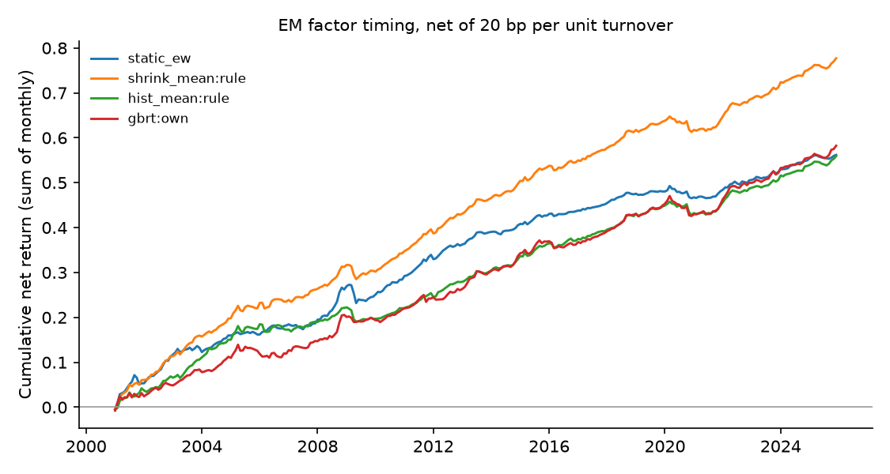

# Emerging-market factor timing — run summary

> **Real data (JKP global factor returns).** Results are out-of-sample forecasts; see caveats.

Test region: EM · out-of-sample from 2000 · cost 20.0 bp per unit of timing turnover

## Out-of-sample R² against each factor's historical mean

Positive = beats the historical mean. `cw_t` is the Clark–West statistic (monthly, Newey–West).

| model | scope | r2_vs_hist_pct | cw_t_hist | r2_vs_shrink_pct | cw_t_shrink | obs | months |
| --- | --- | --- | --- | --- | --- | --- | --- |
| shrink_mean | rule | 1.148 | 9.207 | 0.000 | nan | 785105 | 300 |
| enet | own | 1.133 | 8.608 | -0.016 | 1.938 | 785105 | 300 |
| ols | own | 1.125 | 8.595 | -0.023 | 1.976 | 785105 | 300 |
| enet | pooled | 1.074 | 8.573 | -0.075 | 2.143 | 785105 | 300 |
| ols | pooled | 1.064 | 8.580 | -0.086 | 2.200 | 785105 | 300 |
| gbrt | pooled | 0.986 | 8.652 | -0.165 | 3.387 | 785105 | 300 |
| enet | dm_only | 0.959 | 8.368 | -0.191 | 2.132 | 785105 | 300 |
| gbrt | own | 0.943 | 8.467 | -0.208 | 3.250 | 785105 | 300 |
| ols | dm_only | 0.939 | 8.362 | -0.212 | 2.156 | 785105 | 300 |
| gbrt | dm_only | 0.829 | 8.133 | -0.323 | 3.380 | 785105 | 300 |
| hist_mean | rule | 0.000 | nan | -1.162 | -7.726 | 785105 | 300 |

## Timing portfolios (equal-weighted across countries)

| strategy | mean_ann_pct | vol_ann_pct | sharpe_gross | sharpe_net | turnover_monthly | months |
| --- | --- | --- | --- | --- | --- | --- |
| shrink_mean:rule | 3.246 | 1.565 | 2.074 | 1.986 | 0.057 | 300 |
| hist_mean:rule | 2.404 | 1.477 | 1.627 | 1.513 | 0.069 | 300 |
| static_ew | 2.288 | 1.558 | 1.469 | 1.441 | 0.017 | 300 |
| gbrt:own | 3.426 | 1.738 | 1.971 | 1.344 | 0.457 | 300 |
| enet:own | 3.244 | 1.868 | 1.737 | 1.254 | 0.383 | 300 |
| ols:own | 3.226 | 1.887 | 1.710 | 1.207 | 0.401 | 300 |
| gbrt:pooled | 3.679 | 2.020 | 1.821 | 1.195 | 0.528 | 300 |
| gbrt:dm_only | 3.761 | 2.127 | 1.769 | 1.108 | 0.587 | 300 |
| enet:pooled | 3.258 | 2.047 | 1.591 | 0.984 | 0.520 | 300 |
| ols:pooled | 3.246 | 2.061 | 1.575 | 0.960 | 0.531 | 300 |
| enet:dm_only | 3.158 | 2.119 | 1.491 | 0.809 | 0.603 | 300 |
| ols:dm_only | 3.131 | 2.127 | 1.472 | 0.786 | 0.609 | 300 |

## Coverage

71 countries, 153 factors at most per country.
