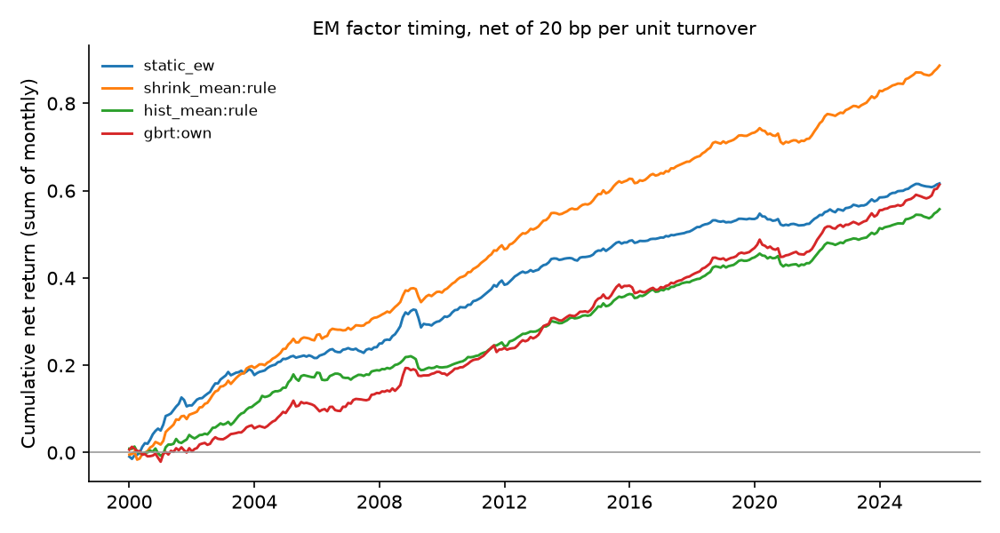

# Emerging-market factor timing — run summary

> **Real data (JKP global factor returns).** Results are out-of-sample forecasts; see caveats.

Test region: EM · out-of-sample from 2000 · cost 20.0 bp per unit of timing turnover

## Out-of-sample R² against each factor's historical mean

Positive = beats the historical mean. `cw_t` is the Clark–West statistic (monthly, Newey–West).

| model | scope | r2_vs_hist_pct | cw_t_hist | r2_vs_shrink_pct | cw_t_shrink | obs | months |
| --- | --- | --- | --- | --- | --- | --- | --- |
| shrink_mean | rule | 1.356 | 9.616 | 0.000 | nan | 801536 | 312 |
| enet | own | 1.289 | 9.425 | -0.069 | 0.791 | 801536 | 312 |
| ols | own | 1.280 | 9.408 | -0.078 | 0.852 | 801536 | 312 |
| enet | pooled | 1.252 | 9.508 | -0.106 | 1.372 | 801536 | 312 |
| ols | pooled | 1.241 | 9.499 | -0.117 | 1.439 | 801536 | 312 |
| gbrt | pooled | 1.228 | 9.495 | -0.130 | 3.753 | 801536 | 312 |
| enet | dm_only | 1.162 | 9.372 | -0.197 | 1.516 | 801536 | 312 |
| ols | dm_only | 1.143 | 9.373 | -0.217 | 1.528 | 801536 | 312 |
| gbrt | dm_only | 1.099 | 9.006 | -0.261 | 3.452 | 801536 | 312 |
| gbrt | own | 1.095 | 9.537 | -0.265 | 2.884 | 801536 | 312 |
| hist_mean | rule | 0.000 | nan | -1.375 | -6.277 | 801536 | 312 |
| fmom | rule | -6.169 | 5.006 | -7.628 | 2.364 | 801536 | 312 |

## Timing portfolios (equal-weighted across countries)

| strategy | mean_ann_pct | vol_ann_pct | sharpe_gross | sharpe_net | turnover_monthly | months |
| --- | --- | --- | --- | --- | --- | --- |
| shrink_mean:rule | 3.545 | 1.662 | 2.133 | 2.052 | 0.056 | 312 |
| static_ew | 2.415 | 1.604 | 1.505 | 1.477 | 0.018 | 312 |
| hist_mean:rule | 2.319 | 1.514 | 1.532 | 1.413 | 0.073 | 312 |
| gbrt:own | 3.554 | 1.797 | 1.978 | 1.306 | 0.497 | 312 |
| gbrt:pooled | 3.926 | 2.093 | 1.876 | 1.207 | 0.578 | 312 |
| enet:own | 3.390 | 1.964 | 1.726 | 1.190 | 0.433 | 312 |
| gbrt:dm_only | 4.018 | 2.166 | 1.855 | 1.146 | 0.638 | 312 |
| ols:own | 3.366 | 1.985 | 1.696 | 1.143 | 0.452 | 312 |
| enet:pooled | 3.407 | 2.158 | 1.579 | 0.937 | 0.573 | 312 |
| ols:pooled | 3.389 | 2.171 | 1.561 | 0.909 | 0.586 | 312 |
| fmom:rule | 2.025 | 1.837 | 1.102 | 0.775 | 0.250 | 312 |
| enet:dm_only | 3.309 | 2.243 | 1.475 | 0.773 | 0.653 | 312 |
| ols:dm_only | 3.275 | 2.252 | 1.454 | 0.747 | 0.661 | 312 |

## Coverage

71 countries, 153 factors at most per country.
