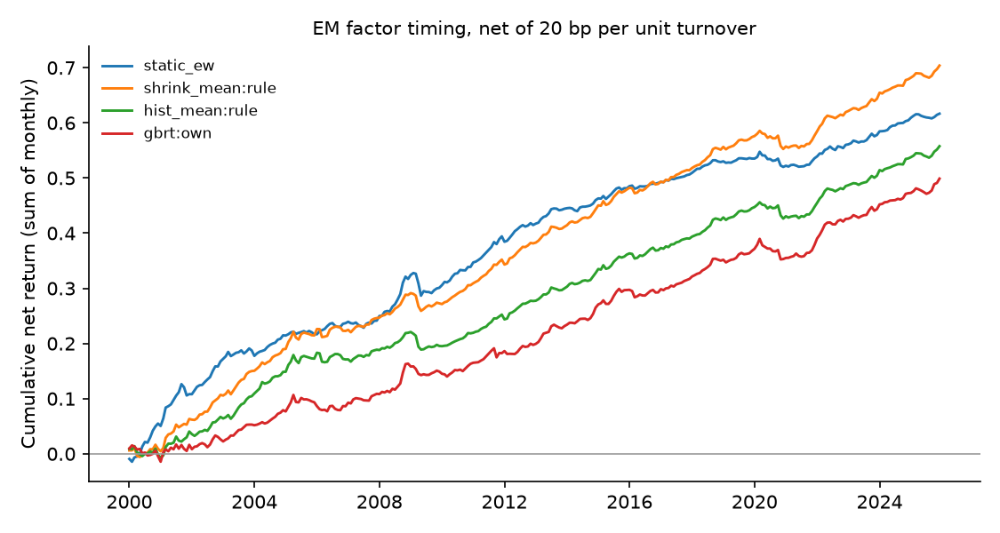

# Emerging-market factor timing — run summary

> **Real data (JKP global factor returns).** Results are out-of-sample forecasts; see caveats.

Test region: EM · out-of-sample from 2000 · cost 20.0 bp per unit of timing turnover

## Out-of-sample R² against each factor's historical mean

Positive = beats the historical mean. `cw_t` is the Clark–West statistic (monthly, Newey–West).

| model | scope | r2_vs_hist_pct | cw_t_hist | r2_vs_shrink_pct | cw_t_shrink | obs | months |
| --- | --- | --- | --- | --- | --- | --- | --- |
| shrink_mean | rule | 0.976 | 8.524 | 0.000 | nan | 801536 | 312 |
| enet | own | 0.972 | 8.058 | -0.004 | 3.126 | 801536 | 312 |
| ols | own | 0.963 | 8.051 | -0.013 | 3.136 | 801536 | 312 |
| enet | pooled | 0.935 | 8.163 | -0.042 | 3.276 | 801536 | 312 |
| ols | pooled | 0.922 | 8.162 | -0.054 | 3.329 | 801536 | 312 |
| gbrt | pooled | 0.916 | 8.343 | -0.061 | 5.054 | 801536 | 312 |
| enet | dm_only | 0.849 | 8.017 | -0.129 | 3.080 | 801536 | 312 |
| ols | dm_only | 0.827 | 8.020 | -0.150 | 3.094 | 801536 | 312 |
| gbrt | dm_only | 0.801 | 7.868 | -0.176 | 4.460 | 801536 | 312 |
| gbrt | own | 0.783 | 8.111 | -0.195 | 4.479 | 801536 | 312 |
| hist_mean | rule | 0.000 | nan | -0.985 | -8.450 | 801536 | 312 |
| fmom | rule | -6.169 | 5.006 | -7.215 | 2.700 | 801536 | 312 |

## Timing portfolios (equal-weighted across countries)

| strategy | mean_ann_pct | vol_ann_pct | sharpe_gross | sharpe_net | turnover_monthly | months |
| --- | --- | --- | --- | --- | --- | --- |
| shrink_mean:rule | 2.863 | 1.561 | 1.834 | 1.731 | 0.065 | 312 |
| static_ew | 2.415 | 1.604 | 1.505 | 1.477 | 0.018 | 312 |
| hist_mean:rule | 2.319 | 1.514 | 1.532 | 1.413 | 0.073 | 312 |
| gbrt:own | 3.009 | 1.653 | 1.821 | 1.152 | 0.454 | 312 |
| gbrt:pooled | 3.384 | 1.915 | 1.767 | 1.106 | 0.524 | 312 |
| gbrt:dm_only | 3.584 | 2.016 | 1.778 | 1.089 | 0.579 | 312 |
| enet:own | 2.737 | 1.795 | 1.525 | 1.001 | 0.388 | 312 |
| ols:own | 2.726 | 1.817 | 1.500 | 0.960 | 0.405 | 312 |
| enet:pooled | 2.884 | 2.003 | 1.440 | 0.825 | 0.510 | 312 |
| ols:pooled | 2.872 | 2.017 | 1.424 | 0.799 | 0.522 | 312 |
| fmom:rule | 2.025 | 1.837 | 1.102 | 0.775 | 0.250 | 312 |
| enet:dm_only | 2.879 | 2.100 | 1.371 | 0.699 | 0.586 | 312 |
| ols:dm_only | 2.850 | 2.108 | 1.352 | 0.674 | 0.594 | 312 |

## Coverage

71 countries, 153 factors at most per country.
