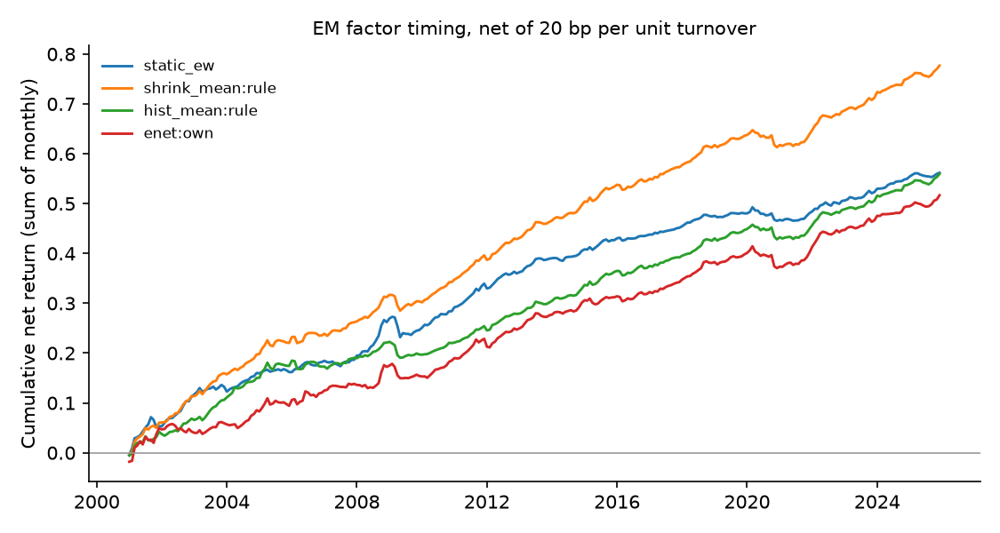

# Emerging-market factor timing — run summary

> **Real data (JKP global factor returns).** Results are out-of-sample forecasts; see caveats.

Test region: EM · out-of-sample from 2000 · cost 20.0 bp per unit of timing turnover

## Out-of-sample R² against each factor's historical mean

Positive = beats the historical mean. `cw_t` is the Clark–West statistic (monthly, Newey–West).

| model | scope | r2_vs_hist_pct | cw_t_hist | r2_vs_shrink_pct | cw_t_shrink | obs | months |
| --- | --- | --- | --- | --- | --- | --- | --- |
| shrink_mean | rule | 1.148 | 9.207 | 0.000 | nan | 785105 | 300 |
| enet | own | 1.081 | 8.614 | -0.069 | 1.467 | 785105 | 300 |
| ols | own | 1.061 | 8.573 | -0.088 | 1.471 | 785105 | 300 |
| enet | pooled | 1.027 | 8.636 | -0.123 | 1.871 | 785105 | 300 |
| ols | pooled | 1.006 | 8.656 | -0.144 | 1.912 | 785105 | 300 |
| enet | dm_only | 0.917 | 8.480 | -0.234 | 1.976 | 785105 | 300 |
| ols | dm_only | 0.888 | 8.499 | -0.264 | 1.999 | 785105 | 300 |
| gbrt | own | 0.769 | 4.783 | -0.383 | 1.374 | 785105 | 300 |
| gbrt | pooled | 0.408 | 6.558 | -0.749 | 0.785 | 785105 | 300 |
| gbrt | dm_only | 0.109 | 6.814 | -1.051 | 0.577 | 785105 | 300 |
| hist_mean | rule | 0.000 | nan | -1.162 | -7.726 | 785105 | 300 |

## Timing portfolios (equal-weighted across countries)

| strategy | mean_ann_pct | vol_ann_pct | sharpe_gross | sharpe_net | turnover_monthly | months |
| --- | --- | --- | --- | --- | --- | --- |
| shrink_mean:rule | 3.246 | 1.565 | 2.074 | 1.986 | 0.057 | 300 |
| hist_mean:rule | 2.404 | 1.477 | 1.627 | 1.513 | 0.069 | 300 |
| static_ew | 2.288 | 1.558 | 1.469 | 1.441 | 0.017 | 300 |
| enet:own | 3.022 | 1.875 | 1.612 | 1.108 | 0.398 | 300 |
| ols:own | 2.982 | 1.895 | 1.574 | 1.051 | 0.417 | 300 |
| enet:pooled | 3.074 | 2.043 | 1.505 | 0.877 | 0.536 | 300 |
| gbrt:own | 2.947 | 1.910 | 1.543 | 0.846 | 0.540 | 300 |
| ols:pooled | 3.039 | 2.052 | 1.481 | 0.842 | 0.547 | 300 |
| enet:dm_only | 2.989 | 2.108 | 1.418 | 0.715 | 0.618 | 300 |
| ols:dm_only | 2.940 | 2.108 | 1.394 | 0.684 | 0.625 | 300 |
| gbrt:pooled | 2.732 | 2.024 | 1.350 | 0.620 | 0.607 | 300 |
| gbrt:dm_only | 2.487 | 2.055 | 1.211 | 0.426 | 0.665 | 300 |

## Coverage

71 countries, 153 factors at most per country.
