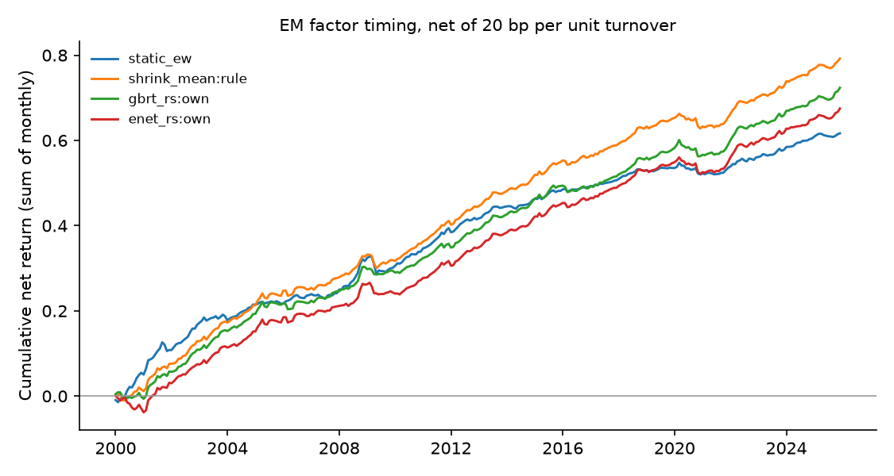

# Emerging-market factor timing — run summary

> **Real data (JKP global factor returns).** Results are out-of-sample forecasts; see caveats.

Test region: EM · out-of-sample from 2000 · cost 20.0 bp per unit of timing turnover

## Out-of-sample R² against each factor's historical mean

Positive = beats the historical mean. `cw_t` is the Clark–West statistic (monthly, Newey–West).

| model | scope | r2_vs_hist_pct | cw_t_hist | r2_vs_shrink_pct | cw_t_shrink | obs | months |
| --- | --- | --- | --- | --- | --- | --- | --- |
| shrink_mean | rule | 1.203 | 9.049 | 0.000 | nan | 801536 | 312 |
| gbrt_rs | own | 1.183 | 9.454 | -0.019 | 2.036 | 801536 | 312 |
| enet_rs | own | 1.180 | 8.918 | -0.023 | 0.900 | 801536 | 312 |
| ols_rs | own | 1.171 | 8.869 | -0.031 | 0.816 | 801536 | 312 |
| enet | own | 1.157 | 8.733 | -0.046 | 1.559 | 801536 | 312 |
| ols | own | 1.148 | 8.722 | -0.055 | 1.611 | 801536 | 312 |
| enet_rs | pooled | 1.140 | 8.407 | -0.063 | 1.377 | 801536 | 312 |
| ols_rs | pooled | 1.136 | 8.381 | -0.067 | 1.423 | 801536 | 312 |
| gbrt_rs | pooled | 1.122 | 8.555 | -0.081 | 3.138 | 801536 | 312 |
| enet | pooled | 1.119 | 8.831 | -0.084 | 2.029 | 801536 | 312 |
| ols | pooled | 1.108 | 8.825 | -0.096 | 2.101 | 801536 | 312 |
| gbrt | pooled | 1.096 | 8.952 | -0.108 | 4.248 | 801536 | 312 |
| enet_rs | dm_only | 1.075 | 8.180 | -0.129 | 1.394 | 801536 | 312 |
| gbrt_rs | dm_only | 1.073 | 8.126 | -0.131 | 2.518 | 801536 | 312 |
| ols_rs | dm_only | 1.066 | 8.160 | -0.139 | 1.391 | 801536 | 312 |
| enet | dm_only | 1.031 | 8.695 | -0.174 | 2.079 | 801536 | 312 |
| ols | dm_only | 1.011 | 8.698 | -0.194 | 2.096 | 801536 | 312 |
| gbrt | own | 0.993 | 8.885 | -0.212 | 3.662 | 801536 | 312 |
| gbrt | dm_only | 0.973 | 8.446 | -0.233 | 3.792 | 801536 | 312 |
| hist_mean | rule | 0.000 | nan | -1.217 | -8.031 | 801536 | 312 |

## Timing portfolios (equal-weighted across countries)

| strategy | mean_ann_pct | vol_ann_pct | sharpe_gross | sharpe_net | turnover_monthly | months |
| --- | --- | --- | --- | --- | --- | --- |
| shrink_mean:rule | 3.192 | 1.598 | 1.998 | 1.905 | 0.061 | 312 |
| gbrt_rs:own | 3.368 | 1.609 | 2.094 | 1.705 | 0.244 | 312 |
| enet_rs:own | 3.163 | 1.680 | 1.883 | 1.525 | 0.236 | 312 |
| ols_rs:own | 3.151 | 1.688 | 1.867 | 1.511 | 0.237 | 312 |
| static_ew | 2.415 | 1.604 | 1.505 | 1.477 | 0.018 | 312 |
| gbrt_rs:dm_only | 3.667 | 1.887 | 1.944 | 1.476 | 0.372 | 312 |
| gbrt_rs:pooled | 3.578 | 1.844 | 1.940 | 1.473 | 0.354 | 312 |
| hist_mean:rule | 2.319 | 1.514 | 1.532 | 1.413 | 0.073 | 312 |
| gbrt:own | 3.338 | 1.717 | 1.944 | 1.265 | 0.479 | 312 |
| gbrt:pooled | 3.689 | 2.014 | 1.831 | 1.168 | 0.552 | 312 |
| enet_rs:pooled | 3.176 | 1.958 | 1.622 | 1.152 | 0.380 | 312 |
| ols_rs:pooled | 3.172 | 1.961 | 1.617 | 1.142 | 0.385 | 312 |
| gbrt:dm_only | 3.833 | 2.101 | 1.824 | 1.125 | 0.611 | 312 |
| enet:own | 3.095 | 1.883 | 1.643 | 1.112 | 0.412 | 312 |
| ols:own | 3.077 | 1.906 | 1.614 | 1.067 | 0.430 | 312 |
| enet_rs:dm_only | 3.121 | 2.021 | 1.544 | 1.035 | 0.425 | 312 |
| ols_rs:dm_only | 3.105 | 2.024 | 1.535 | 1.022 | 0.428 | 312 |
| enet:pooled | 3.160 | 2.086 | 1.514 | 0.885 | 0.544 | 312 |
| ols:pooled | 3.144 | 2.100 | 1.497 | 0.857 | 0.557 | 312 |
| enet:dm_only | 3.104 | 2.179 | 1.424 | 0.737 | 0.622 | 312 |
| ols:dm_only | 3.074 | 2.188 | 1.405 | 0.711 | 0.630 | 312 |

## Coverage

71 countries, 153 factors at most per country.
