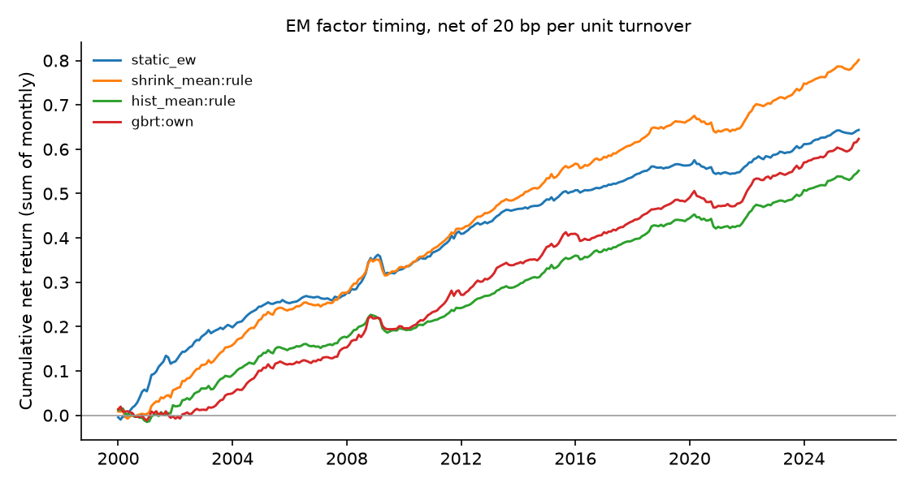

# Emerging-market factor timing — run summary

> **Real data (JKP global factor returns).** Results are out-of-sample forecasts; see caveats.

Test region: EM · out-of-sample from 2000 · cost 20.0 bp per unit of timing turnover

## Out-of-sample R² against each factor's historical mean

Positive = beats the historical mean. `cw_t` is the Clark–West statistic (monthly, Newey–West).

| model | scope | r2_vs_hist_pct | cw_t_hist | r2_vs_shrink_pct | cw_t_shrink | obs | months |
| --- | --- | --- | --- | --- | --- | --- | --- |
| shrink_mean | rule | 1.229 | 8.325 | 0.000 | nan | 793475 | 312 |
| enet | own | 1.182 | 8.321 | -0.047 | 1.837 | 793475 | 312 |
| ols | own | 1.172 | 8.311 | -0.058 | 1.867 | 793475 | 312 |
| enet | pooled | 1.147 | 8.307 | -0.084 | 2.145 | 793475 | 312 |
| ols | pooled | 1.136 | 8.309 | -0.095 | 2.225 | 793475 | 312 |
| gbrt | pooled | 1.075 | 8.464 | -0.157 | 3.667 | 793475 | 312 |
| enet | dm_only | 1.049 | 8.172 | -0.183 | 2.019 | 793475 | 312 |
| ols | dm_only | 1.030 | 8.176 | -0.202 | 2.059 | 793475 | 312 |
| gbrt | own | 0.993 | 8.506 | -0.240 | 3.658 | 793475 | 312 |
| gbrt | dm_only | 0.915 | 7.844 | -0.318 | 3.284 | 793475 | 312 |
| hist_mean | rule | 0.000 | nan | -1.245 | -8.466 | 793475 | 312 |
| fmom | rule | -6.112 | 5.302 | -7.433 | 2.722 | 793475 | 312 |

## Timing portfolios (equal-weighted across countries)

| strategy | mean_ann_pct | vol_ann_pct | sharpe_gross | sharpe_net | turnover_monthly | months |
| --- | --- | --- | --- | --- | --- | --- |
| shrink_mean:rule | 3.221 | 1.564 | 2.059 | 1.969 | 0.058 | 312 |
| static_ew | 2.517 | 1.586 | 1.587 | 1.562 | 0.018 | 312 |
| hist_mean:rule | 2.291 | 1.413 | 1.621 | 1.497 | 0.071 | 312 |
| gbrt:own | 3.482 | 1.663 | 2.094 | 1.428 | 0.452 | 312 |
| enet:own | 3.125 | 1.818 | 1.719 | 1.185 | 0.399 | 312 |
| gbrt:pooled | 3.591 | 1.990 | 1.805 | 1.156 | 0.532 | 312 |
| ols:own | 3.105 | 1.835 | 1.692 | 1.143 | 0.415 | 312 |
| gbrt:dm_only | 3.682 | 2.127 | 1.731 | 1.054 | 0.596 | 312 |
| enet:pooled | 3.239 | 2.018 | 1.605 | 0.979 | 0.522 | 312 |
| ols:pooled | 3.233 | 2.031 | 1.592 | 0.956 | 0.534 | 312 |
| fmom:rule | 2.252 | 1.802 | 1.250 | 0.919 | 0.249 | 312 |
| enet:dm_only | 3.192 | 2.118 | 1.507 | 0.831 | 0.593 | 312 |
| ols:dm_only | 3.172 | 2.127 | 1.491 | 0.808 | 0.602 | 312 |

## Coverage

71 countries, 153 factors at most per country.
