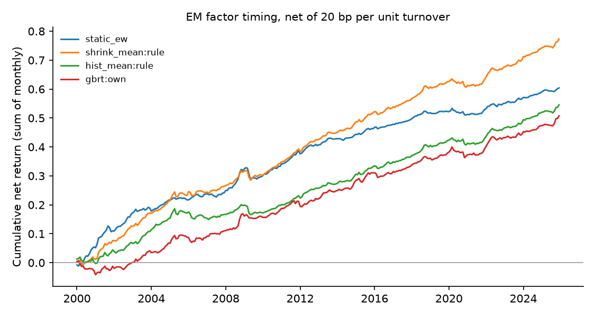

# Emerging-market factor timing — run summary

> **Real data (JKP global factor returns).** Results are out-of-sample forecasts; see caveats.

Test region: EM · out-of-sample from 2000 · cost 20.0 bp per unit of timing turnover

## Out-of-sample R² against each factor's historical mean

Positive = beats the historical mean. `cw_t` is the Clark–West statistic (monthly, Newey–West).

| model | scope | r2_vs_hist_pct | cw_t_hist | r2_vs_shrink_pct | cw_t_shrink | obs | months |
| --- | --- | --- | --- | --- | --- | --- | --- |
| shrink_mean | rule | 1.194 | 8.782 | 0.000 | nan | 801536 | 312 |
| enet | own | 1.140 | 8.758 | -0.054 | 1.279 | 801536 | 312 |
| ols | own | 1.131 | 8.737 | -0.063 | 1.351 | 801536 | 312 |
| enet | pooled | 1.122 | 9.021 | -0.073 | 1.445 | 801536 | 312 |
| ols | pooled | 1.111 | 9.032 | -0.084 | 1.497 | 801536 | 312 |
| enet | dm_only | 1.066 | 8.992 | -0.129 | 1.370 | 801536 | 312 |
| ols | dm_only | 1.054 | 8.994 | -0.141 | 1.430 | 801536 | 312 |
| gbrt | pooled | 1.011 | 8.956 | -0.184 | 2.389 | 801536 | 312 |
| gbrt | dm_only | 0.949 | 8.285 | -0.247 | 3.136 | 801536 | 312 |
| gbrt | own | 0.903 | 8.412 | -0.294 | 1.214 | 801536 | 312 |
| hist_mean | rule | 0.000 | nan | -1.208 | -7.505 | 801536 | 312 |
| fmom | rule | -6.278 | 4.566 | -7.562 | 2.000 | 801536 | 312 |

## Timing portfolios (equal-weighted across countries)

| strategy | mean_ann_pct | vol_ann_pct | sharpe_gross | sharpe_net | turnover_monthly | months |
| --- | --- | --- | --- | --- | --- | --- |
| shrink_mean:rule | 3.124 | 1.648 | 1.895 | 1.802 | 0.062 | 312 |
| static_ew | 2.367 | 1.607 | 1.473 | 1.445 | 0.018 | 312 |
| hist_mean:rule | 2.276 | 1.589 | 1.432 | 1.316 | 0.074 | 312 |
| gbrt:own | 3.047 | 1.764 | 1.728 | 1.097 | 0.456 | 312 |
| gbrt:dm_only | 3.557 | 2.159 | 1.647 | 1.058 | 0.530 | 312 |
| gbrt:pooled | 3.412 | 2.121 | 1.609 | 1.046 | 0.492 | 312 |
| enet:own | 2.926 | 1.897 | 1.542 | 1.035 | 0.395 | 312 |
| ols:own | 2.894 | 1.922 | 1.506 | 0.980 | 0.415 | 312 |
| enet:pooled | 3.070 | 2.151 | 1.428 | 0.869 | 0.497 | 312 |
| ols:pooled | 3.044 | 2.167 | 1.405 | 0.836 | 0.510 | 312 |
| enet:dm_only | 3.002 | 2.245 | 1.338 | 0.741 | 0.555 | 312 |
| ols:dm_only | 2.990 | 2.263 | 1.321 | 0.721 | 0.562 | 312 |
| fmom:rule | 2.020 | 2.001 | 1.009 | 0.705 | 0.253 | 312 |

## Coverage

71 countries, 153 factors at most per country.
