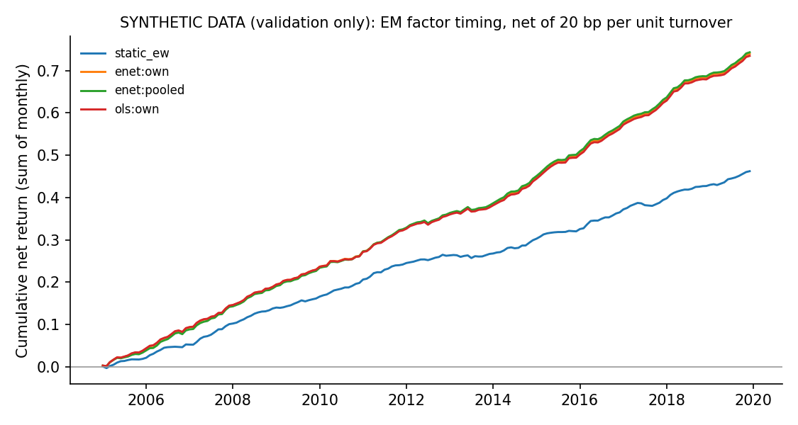

# Emerging-market factor timing — run summary

> **SYNTHETIC DATA — software validation, not a finding.**

Test region: EM · out-of-sample from 2005 · cost 20.0 bp per unit of timing turnover

## Out-of-sample R² against each factor's historical mean

Positive = beats the historical mean. `cw_t` is the Clark–West statistic (monthly, Newey–West).

| model | scope | r2_vs_hist_pct | cw_t_hist | r2_vs_shrink_pct | cw_t_shrink | obs | months |
| --- | --- | --- | --- | --- | --- | --- | --- |
| enet | own | 0.432 | 9.140 | 0.260 | 7.658 | 28800 | 180 |
| ols | own | 0.432 | 9.095 | 0.260 | 7.587 | 28800 | 180 |
| ols | pooled | 0.411 | 9.221 | 0.240 | 7.251 | 28800 | 180 |
| enet | pooled | 0.408 | 9.283 | 0.237 | 7.303 | 28800 | 180 |
| ols | dm_only | 0.361 | 8.975 | 0.189 | 6.209 | 28800 | 180 |
| enet | dm_only | 0.357 | 9.166 | 0.185 | 6.220 | 28800 | 180 |
| gbrt | pooled | 0.298 | 7.963 | 0.126 | 5.665 | 28800 | 180 |
| nn | pooled | 0.295 | 8.146 | 0.123 | 5.679 | 28800 | 180 |
| gbrt | own | 0.276 | 8.656 | 0.104 | 6.977 | 28800 | 180 |
| shrink_mean | rule | 0.172 | 6.050 | 0.000 | nan | 28800 | 180 |
| gbrt | dm_only | 0.096 | 5.331 | -0.077 | 3.092 | 28800 | 180 |
| hist_mean | rule | 0.000 | nan | -0.172 | -1.341 | 28800 | 180 |
| nn | own | -0.018 | 6.039 | -0.190 | 4.327 | 28800 | 180 |
| nn | dm_only | -0.128 | 4.247 | -0.300 | 2.108 | 28800 | 180 |
| fmom | rule | -6.994 | 5.065 | -7.179 | 4.848 | 28800 | 180 |

## Timing portfolios (equal-weighted across countries)

| strategy | mean_ann_pct | vol_ann_pct | sharpe_gross | sharpe_net | turnover_monthly | months |
| --- | --- | --- | --- | --- | --- | --- |
| enet:own | 5.292 | 1.113 | 4.753 | 4.425 | 0.150 | 180 |
| enet:pooled | 5.232 | 1.124 | 4.653 | 4.405 | 0.115 | 180 |
| ols:own | 5.293 | 1.114 | 4.753 | 4.395 | 0.164 | 180 |
| ols:pooled | 5.238 | 1.123 | 4.662 | 4.386 | 0.127 | 180 |
| enet:dm_only | 5.128 | 1.136 | 4.514 | 4.300 | 0.100 | 180 |
| ols:dm_only | 5.139 | 1.135 | 4.529 | 4.299 | 0.107 | 180 |
| shrink_mean:rule | 4.774 | 1.148 | 4.159 | 4.103 | 0.026 | 180 |
| nn:pooled | 5.073 | 1.135 | 4.471 | 3.966 | 0.237 | 180 |
| gbrt:pooled | 5.047 | 1.075 | 4.693 | 3.964 | 0.314 | 180 |
| hist_mean:rule | 4.692 | 1.178 | 3.984 | 3.921 | 0.030 | 180 |
| gbrt:own | 5.059 | 1.060 | 4.771 | 3.794 | 0.425 | 180 |
| nn:own | 4.734 | 1.054 | 4.493 | 3.543 | 0.410 | 180 |
| static_ew | 3.082 | 0.893 | 3.452 | 3.452 | 0.000 | 180 |
| gbrt:dm_only | 4.711 | 1.101 | 4.277 | 3.389 | 0.397 | 180 |
| nn:dm_only | 4.451 | 1.108 | 4.019 | 3.121 | 0.404 | 180 |
| fmom:rule | 2.053 | 0.836 | 2.457 | 1.803 | 0.228 | 180 |

## Coverage

16 countries, 20 factors at most per country.
